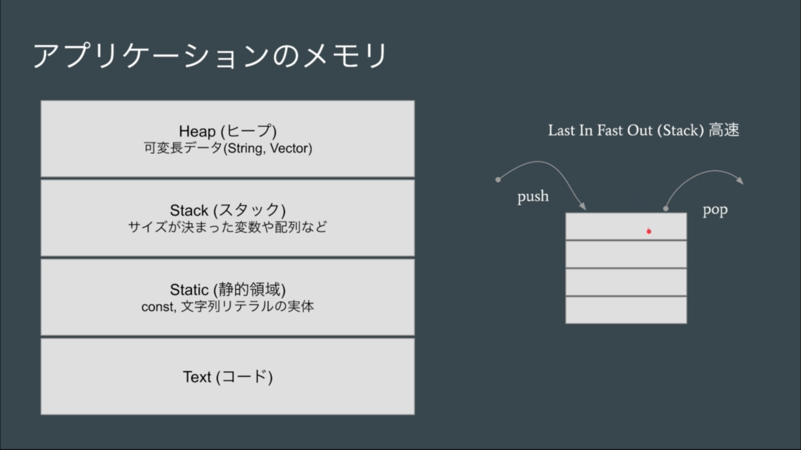
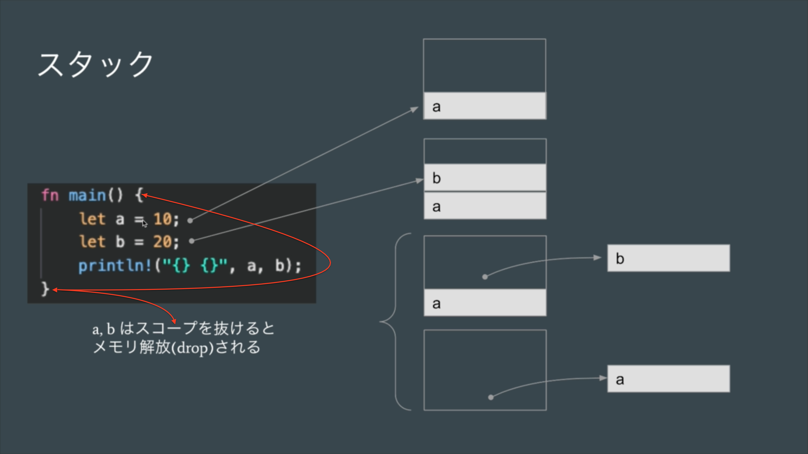
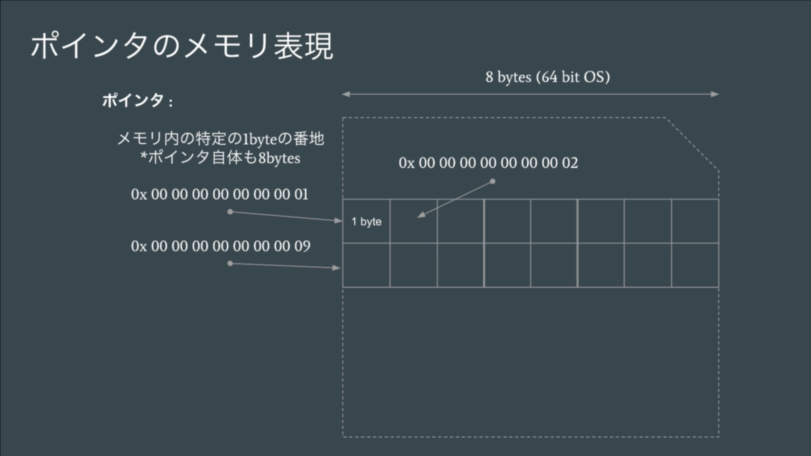
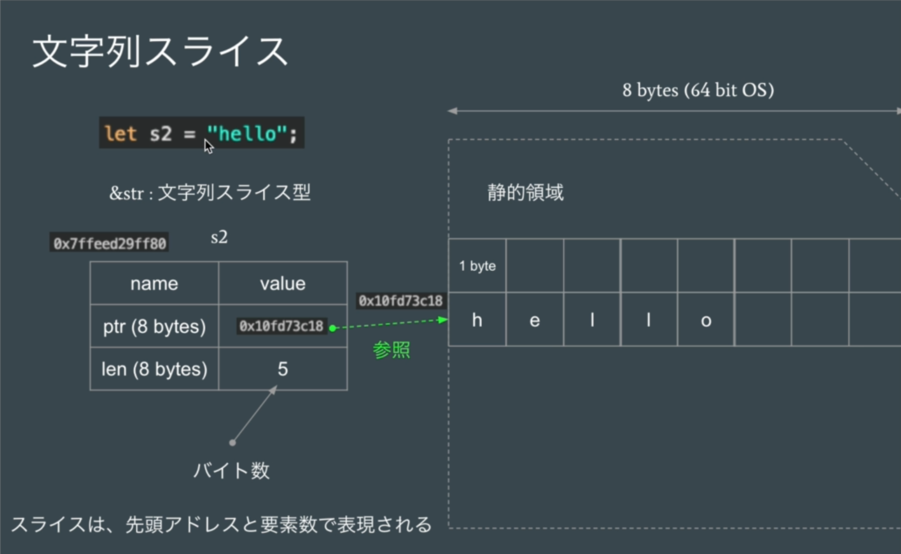
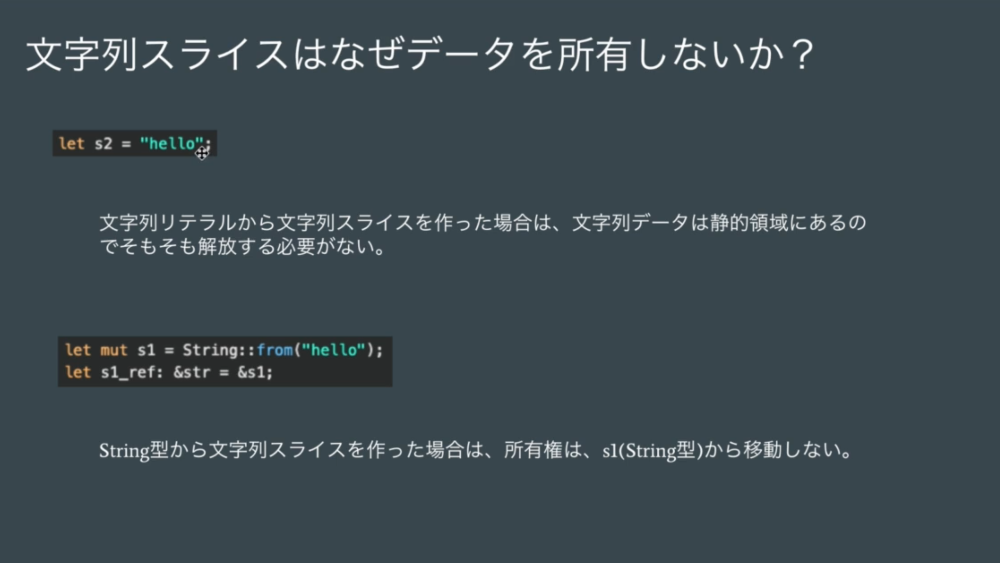
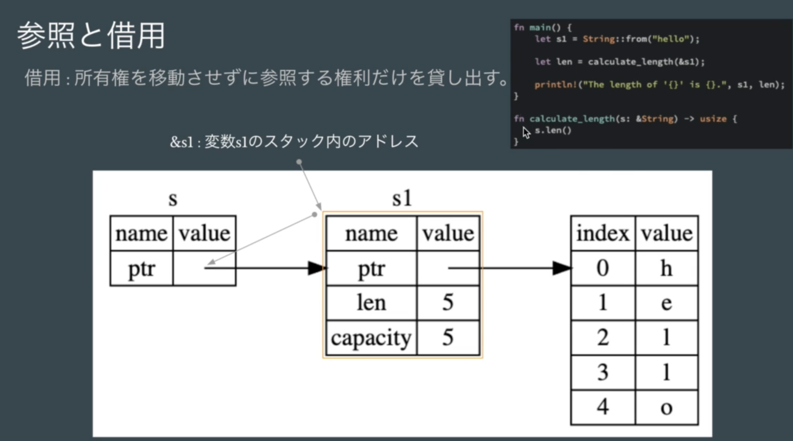
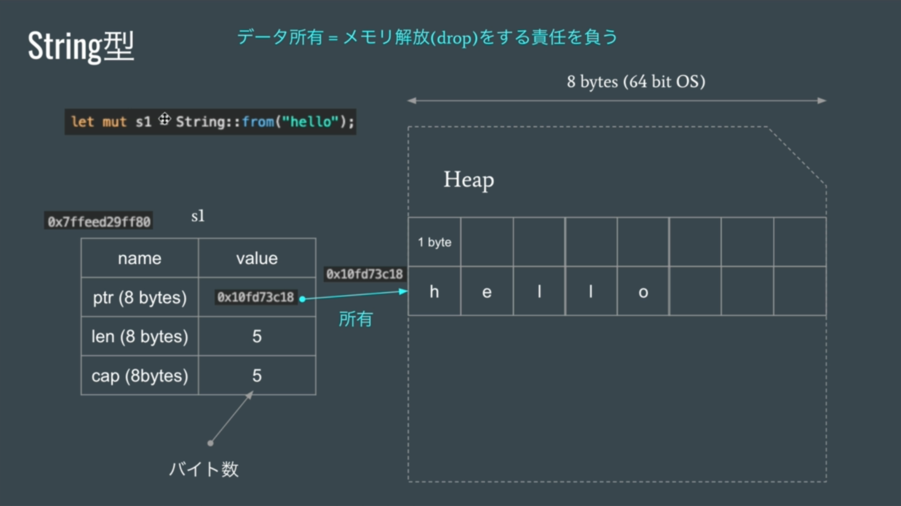
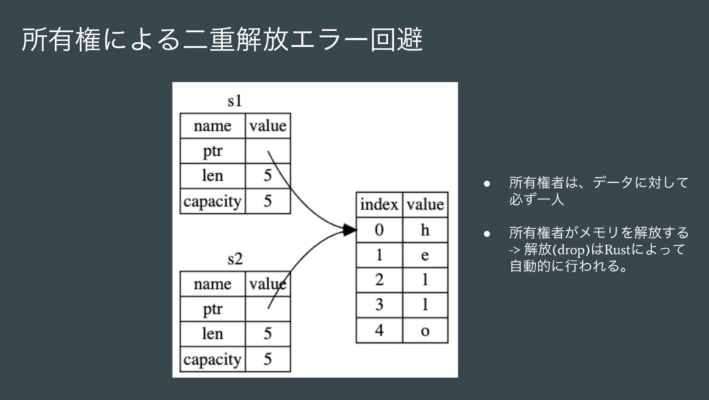

# Rust 言語基礎 document

## Rust App memory

 
 
 

|                                                Memoryの中                                                |
| :------------------------------------------------------------------------------------------------------: |
| **Heap** (ヒープ) 容量が大きく可変長データを扱える(String, Vector) memory access が stack より遅い |
|   **Stack** (スタック) 容量は限られているが高速な　Access ができる sizeが決まった変数や配列など    |
|         **Static**　(静的領域) const (global な定数を定義) 文字列リテラル(hard code)の実態         |
|                        **Text** (コード) compile後のbinary code を保存する場所                        |

 

 
<h3>Last In Fast Out (Stack) 高速</h3>
 
push (入力) 
let で変数を定義（値の代入をバインドという）
 
↓ 
 
Memory 
 
↓ 
 
pop (取り出す) 
スコープ ( { } : カーリーブラケット)を抜けると 
Memory の自動的に解放 (drop) される 
 

### 64bit os (横幅 8bytes)
- **pointer は memory内の番地(address)を表している**

  - *1byte ごとにaddressが割り振られている*

- 32bit os
  - 横幅 4bytes :

 
 
 

## 文字列の slice と String型
### 文字列 slice
- Rust は utf-8 を採用している
  -  1 ~ 4 byte を自動的に割り当てていく

     - 英字 = **1byte**
     - 日本語 = **3byte**

- **ptr : 8bytes**　+　**len : 8bytes**　=　**s1(slice 変数) : 16bytes**

 
 
 

#### 参照
- **所有の権限が付与されない data型**

 
 
 

#### 参照と借用

 
 
 

### String型

- ptr : 8bytes　+　len : 8bytes　+　**cap : 8bytes**　=　**s2(String 変数) : 24bytes**

    - *cap : capacity (実データが使用できる最大容量)*
      - rust が自動的に決めてくれる
      - lenth からある程度余裕を持った容量が設定されている

 
 
 

#### 所有権
- **二重開放 error 回避**

    - memory の解放ができる data型

 
 
 

