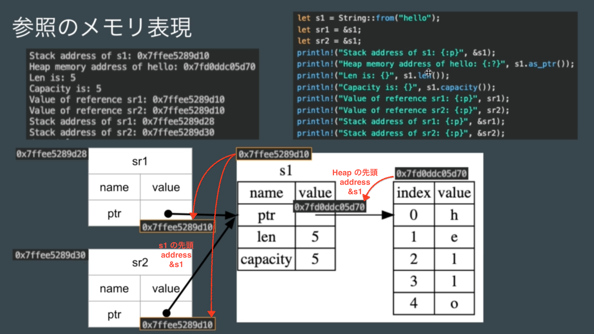

# Rust 言語基礎 document
1. [文字列 slice](#anchor1)
2. [String型](#anchor2)
3. [Vector型](#anchor3)
4. [Box pinter](#anchor4)
5. [ownership & borrowing](#anchor5)
    - 所有権　→　[所有と借用](#anchor5-1)
6. [Life time + Dangling pointer](#anchor6)
7. [Generics life time annotation](#anchor7)
## Rust App memory

 
 
 

|                                                Memoryの中                                                |
| :------------------------------------------------------------------------------------------------------: |
| **Heap** (ヒープ) 容量が大きく可変長データを扱える(String, Vector) memory access が stack より遅い |
|   **Stack** (スタック) 容量は限られているが高速な　Access ができる sizeが決まった変数や配列など    |
|         **Static**　(静的領域) const (global な定数を定義) 文字列リテラル(hard code)の実態         |
|                        **Text** (コード) compile後のbinary code を保存する場所                        |

 

 
<h3>Last In Fast Out (Stack) 高速</h3>
 
push (入力) 
let で変数を定義（値の代入をバインドという） 
 
        ↓ 
 
Memory 
 
        ↓ 
 
pop (取り出す) 
スコープ ( { } : カーリーブラケット)を抜けると 
Memory の自動的に解放 (drop) される 
 

### 64bit os (横幅 8bytes)
- **pointer は memory内の番地(address)を表している**

  - *1byte ごとにaddressが割り振られている*

- 32bit os
  - 横幅 4bytes :

 
 
 

## 文字列 slice
- Rust は utf-8 を採用している
  -  1 ~ 4 byte を自動的に割り当てていく

     - 英字 = **1byte**
     - 日本語 = **3byte**

- **ptr : 8bytes**　+　**len : 8bytes**　=　**s1(slice 変数) : 16bytes**

 
 
 

### 参照
- **所有の権限が付与されない data型**

 
 
 

### 参照と借用

 
 
 

## String型

- ptr : 8bytes　+　len : 8bytes　+　**cap : 8bytes**　=　**s2(String 変数) : 24bytes**

    - *cap : capacity (実データが使用できる最大容量)*
      - rust が自動的に決めてくれる
      - lenth からある程度余裕を持った容量が設定されている

 
 
 

### 所有権
- **二重開放 error 回避**

    - memory の解放ができる data型

 
 
 

## Vector型
 - String 型とほとんど同じ

  - ptr : 8bytes　+　**len : 要素数4(各4bytes)**　+　**cap :  要素数4(各4bytes)**　=　**s2(String 変数) : 24bytes**

    - ptr : heap 先頭の address と data型の情報を保持
    - len : bytes ではなく要素数 (各要素が4bytes)
    - cap : bytes ではなく要素数 (各要素が4bytes)

 
 
 

## Box pointer
- **Box pointer 自体は　= 8bytes** (※ 64bit os)

  - [List 列挙型の定義](https://doc.rust-lang.org/book/ch15-01-box.html#:~:text=which%20will%20compile%3A-,Filename%3A%20src/main.rs,-enum%20List%20%7B%0A%20%20%20%20Cons)

  - size が決まらないと compile できない(**Errorになる**)問題に対応できる
    - $\infty$ 無限 loop をさせない為に　**Box pointer で size を与える**　事によて解決できる

 
 
 
        ↓ 
 
 
 

## 5. Ownership & Borrowing
[所有権について](https://doc.rust-lang.org/book/ch04-01-what-is-ownership.html)

### move

- **所有権を持つ型**
  - `String, Vector, Box pointer`　=　`所有権 move` が発生する
  - `所有権の移動`

  - **move**
    - **値を代入した時に, 代入した値だけではなく所有権も一緒に移譲される**

    - `move` *後は元の変数に access する事はできない*

  - **move が発生する処理**

    - `変数に copy した場合`
    - `関数の引数に与えた場合`
    - `関数の戻り値として与えた場合`

 
 
 

 
 
 

### 5-1. 参照と借用
[参照と借用](#anchor5-1)

 
 
 

 
 
 

### Dangling pointer
- **dangling pointer = Error**
    - `compile` ができる　=　**dangling error はない**

 
 
 

## 7.Generics life time annotation

 
 
 

### Rust memory 安全性
- `RAII`　→　fileを開いた時も同じく, スコープを抜けると自動で close してくれる
  - **RAII は default 機能として Rust言語仕様となっている**

 
 
 

